# How I did it

## Side note: [Sponsor me on GitHub to support awesome projects like this!](https://github.com/sponsors/mmulet)

So, how did I make a video game from a font? To understand the answer, you must first understand fonts.

I imagine the average english speaker thinks a font is something like this:

1. You type a key (We call this a "Character")
2. The letter appears on the screen. (We call this a "Glyph")

When rendering [everyday english characters](https://en.wikipedia.org/wiki/ASCII), that's pretty much correct.
But fonts can do so much more. _A lot_ more. Too much for me to write about in this post, so I'm just going to cover the parts I found to be the most interesting when developing [fontemon](https://www.coderelay.io/fontemon.html). If there is a lot of interest in a particular part, I'll dive into more detail in another post.

This post is broken into Five posts:

1. [Drawing pixel art in a font](#drawing-pixel-art-in-a-font)
2. [Game logic in a font](#game-logic-in-a-font)
3. [How Big of a game can you make in a font](#how-big-of-a-game-can-you-make-in-a-font?)
4. [How not to make a font game](#how-not-to-make-a-font-game)
5. [Font Game Engine](#font-game-engine)

# Drawing pixel art in a font

When you draw something in a font, it's called a `Glyph`. Here are some glyphs rendered on your screen by a font:

- A
- a
- B

In [open type](https://docs.microsoft.com/en-us/typography/opentype/spec/) there are at least 14 ways to draw glyphs:

- [TrueType outlines](https://docs.microsoft.com/en-us/typography/opentype/spec/ttch01)
- [Type2 Charstrings](https://docs.microsoft.com/en-us/typography/opentype/spec/cff)
- [Type2 Charstrings in a different way](https://docs.microsoft.com/en-us/typography/opentype/spec/cff2)
- [Scalable Vector Graphics (SVG)](https://docs.microsoft.com/en-us/typography/opentype/spec/svg)
- [There are nine ways to embed bitmaps](https://docs.microsoft.com/en-us/typography/opentype/spec/ebdt)
- [PNG images](https://docs.microsoft.com/en-us/typography/opentype/spec/cbdt)

I'm probably missing some too. Each way has it's own benefits and drawbacks, for example:

- Embedded bitmaps would be great for drawing pixel art, but they aren't supported in Chrome because the [one guy who sanitizes fonts doesn't have time to work on it.](https://github.com/khaledhosny/ots/issues/200)

  [xkcd 2347](https://xkcd.com/2347/)
  

  I'll make a [www.coderelay.io](https://www.coderelay.io) task to work on it, so don't worry, it will get done

- Color PNG or SVG's would look great, but [for reasons I'll talk about later](#how-not-to-make-a-font-game), they would shorten the game by a large margin. I would only be able to fit the introduction, not even the first gym, and _definitely_ not all 8 gyms.

In the end I went with [Type2 Charstrings](https://docs.microsoft.com/en-us/typography/opentype/spec/cff) (that's CFF, not CFF2).

## Type2 Charstrings

Type 2 Charstrings were developed by Adobe for use in PostScript, which (these days) can be thought of as a precursor to PDF file format. It is a vector graphics format, which means we describe the the glyph in a series of path constructing operators.

Here is the charstring command for drawing a square glyph.

```
10 10 -10 vlineto
endchar
```

The first you'll probably notice is the [reverse polish notation](https://en.wikipedia.org/wiki/Reverse_Polish_notation). I.e. we specify the arguments then the operator. Despite this, the command can be read left to right.
It says:

1. Create a line `10` "units" upwards
2. Create a line `10` "units" to the right
3. Create a line `10` "units" downwards

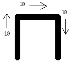

Then, there is the implicit, "close" operator, which will close the shape by creating a line from the last point, to the first point.

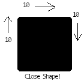

That's how you draw a pixel!

By combining our pixels with move commands we can make any image we want:

```
50 40 rmoveto
10 10 -10 vlineto
50 hmoveto
endchar
```

But, you may have noticed, this only draws in black and white, how do we get color?

## Q: How do you get color?

### A: You don't!

All the color is "fake" in that there is nothing telling the renderer to draw a gray pixel, it all relies on undefined behavior and suggestion. Basically we are trying to "trick" the renderer into drawing shades of gray by drawing "pixels" of smaller and smaller sizes:

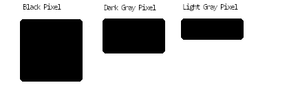
To draw a gray pixel we draw our pixels at a size smaller than an actual physical pixel, then the renderer will "average" the total color of the pixel together, so if we make our pixel half-white, half-black we end up with a gray pixel. Take a look at this example:

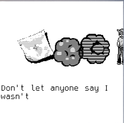

The first cloud on the left has a perfect dark gray, while the cloud on the right, failed. It to doesn't work all the time, but when it fails, it looks like scan-lines which gamers (at least, retro-gamers) are used to.

### Side Note

At first, instead of drawing the Dark Gray Pixel as a half pixel, I used a a checkerboard pattern:

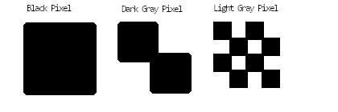

It was much more reliable than the above pattern, and it does not have any scan-lines effect. Unfortunately, rendering the pattern was too slow, and performance suffered on most machines, so I had to switch.

## Type2 Charstrings - Subroutines

Imagine my surprise when I discovered Type 2 charstrings can do more than draw! They can:

- Load/store data in RAM (a whole `32` bytes of it!)
- Generate random numbers
- Do arithmetic
- Control Flow: if, else, etc.

But in reality, most of these operators that are fun and useful for making games, have no support in the wild or [are disabled altogether](https://github.com/khaledhosny/ots/blob/6e9a697bd9a76475d2d947fb1a371e8f7a6edb32/src/cff_charstring.h#L23). But, don't lose hope, there is one incredibly useful operator, with wide support that's perfect for making games: Subroutines.

Subroutines are the function calls of Type2 Charstrings. It allows you to define a sprite once, call it from anywhere! Entire frames in fontemon are a combination of move operators and subroutine calls.

Example:

```xml
<Subroutines>
  <!-- Subroutine: -107 -->
  <CharString>
    10 10 -10 vlineto
    return
  </CharString>
  <!-- Subroutine: -106,
  pixel that is twice as long  -->
  <CharString>
    20 10 -20 vlineto
    return
  </CharString>
   <!-- Subroutine: -105,
  Subroutines can call
  subroutines, (stack limit of 10)  -->
  <CharString name="example_sprite">
    -107 callsubr
    20 hmoveto
    -016 callsbur
    return
  </CharString>

</Subroutines>
<!-- We can position the sprites in the
    frame by moving the cursor and then
    calling the sprites' subroutine. This
    is the first frame of the game -->
<CharString name="glyph00000" >
  20 100 rmoveto
  -105 callsubr
  800 -200 rmoveto
  -105 callsubr
  endchar
<CharString>

```

As you can see from the example: subroutine's are a major space saver. Individual sprites are [run-length encoded](https://en.wikipedia.org/wiki/Run-length_encoding) to save a lot of space and drawing time. Then these sprites are
positioned inside the charstring itself, saving a ton of lookups (which I will [explain later](#how-big-of-a-game-can-you-make-in-a-font?))

# Game logic in a font

In film, we simulate motion through the use of a series of frames. In font games, every key press creates a new frame.
Rather than drawing an A or a B, our glyphs use [subroutines](#type2-charstrings---subroutines) to layout an entire screen.

Example:
Don't let the sprites fool you, this whole screen is one glyph.

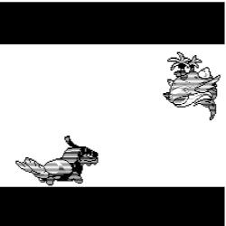

We will call our glyph: `glyph00000`

Here is an snippet of an example charstring:

```xml
<!-- Charstring code for glyph00000
Draw 4 sprites, the two monsters and
two black bars, using subroutines
 -->
<CharString name="glyph00000" >
    20 100 rmoveto
      -105 callsubr
  800 -200 rmoveto
       394 callsubr
    20 100 rmoveto
       294 callsubr
  800 -200 rmoveto
      -105 callsubr
</CharString>
<!-- Numbers fake, but this is
how a frame is drawn. -->
```

To create an animation, we have to advance glyphs in sequence,

- Player presses a key

  - Show `glyph00000`

  

- Player presses another key

  - Hide `glyph00000`
  - Show `glyph00001`

  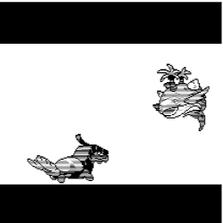

- Player presses another key

  - Hide `glyph00001`
  - Show `glyph00002`

  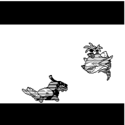

We will create this animation using a typographical element called a ligature.

## Ligatures

In terms of open type fonts, a ligature is when multiple glyphs are replaced by a single glyph.
Here are some examples you might be familiar with in the english language:

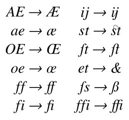

You can also see a good demonstration of ligatures with the popular programming font: [Fira Code](https://github.com/tonsky/FiraCode).

_Side Note_: A lot of the following examples wil be written in [adobe fea files](http://adobe-type-tools.github.io/afdko/OpenTypeFeatureFileSpecification.html). That is a a higher level language for describing typographical features like ligatures.

Example: Fea File

```julia
# A lookup follows this formula:
# ${command} ${condition} ${result}
lookup Frame0 {
  substitute glyph00000 a by glyph00001;
} Frame0;
# This example means:
if a is directly after glyph00000
then
  replace both glyph00000 and a by glyph00001
else
  do nothing
```

Example 2:

```julia
# A lookup can contain multiple conditions
lookup Frame0 {
  substitute glyph00000 a by glyph00001;
  substitute glyph00002 b by glyph00001;
} Frame0;
# The lookup will match the conditions, in order
# So this example means
if a is directly after glyph00000
then
  replace both glyph00000 and a by glyph00001
  stop checking
else if b is directly after glyph00002
then
  replace both glyph00002 and b by glyph00001
else
  do nothing
```

Example 3:

```julia
# We can define glyph classes
# as a convenience
@input = [A a b c d];
lookup Frame0{
  substitute glyph00000 @input by glyph00001;
} Frame0;

...
# This expands to:

lookup Frame0{
  substitute glyph00000 A by glyph00001;
  substitute glyph00000 a by glyph00001;
  substitute glyph00000 b by glyph00001;
  substitute glyph00000 c by glyph00001;
  substitute glyph00000 d by glyph00001;
} Frame0;
```

The best part about lookups, is that they "chain". A lookup defined later uses the result of a lookup defined before.

```julia
lookup Frame1{
  substitute glyph00000 @input by glyph00001;
} Frame1;

lookup Frame2{
  substitute glyph00001 @input by glyph00002;
} Frame2;

lookup Frame3{
  substitute glyph00002 @input by glyph00003;
} Frame3;
```

We substitute `glyph0000` and `@input` by `glyphg0001`,
now if there is another character after that we substitute by `glyph0002`, then `glyph0003` and so on. The entirety of the
game is built upon chaining ligatures together.

The only piece of the puzzle let is:
How we start it all:

```julia
@all = [@input glyph00000-glyph000002]

lookup findSceneChain {
  # This says do not apply this lookup to any pairs
  # of glyphs
  ignore substitute @all @input';

  # If we have a lone glyph, ie(not following any other glyph)
  # then substitute it by glyph00000
  substitute @input' by glyph00000;

} findSceneChain;
```

Instead of ligatures, this uses the [chaining context](https://docs.microsoft.com/en-us/typography/opentype/spec/gsub#CC) lookup type. This makes sure that it only applies to first glyph you type.

# Choices

Now, everything in fontemon is baked. By that I mean:

- all frames
- all sprite positions
- all possible choices you can make

Everything is decided ahead of time and placed in the font. Nothing is calculated during the game.
In computer science terms, it's a [finite state machine](https://en.wikipedia.org/wiki/Finite-state_machine), not a [turing machine](https://en.wikipedia.org/wiki/Turing_machine). In a lot of ways it's like a
[choose your own adventure novel](https://en.wikipedia.org/wiki/Choose_Your_Own_Adventure) or [fmv video game](https://en.wikipedia.org/wiki/Full_motion_video).

Let's look at how we define a choice, it's very similar to what we were doing before:

```julia
lookup level0Conditions{
  substitute glyph00014 @input by glyph00015;
  substitute glyph00014 a by glyph00030;
  substitute glyph00014 b by glyph00050;

} level0Conditions;
```

- If the player presses a, we will replace the input `and` glyph00014 with glyph00030
- if they press b we replace by glyph0050
- If they press anything else, we replace it by glyph00015

### Advanced: About that reverse order:

Those of you familiar with [opentype ligatures](https://docs.microsoft.com/en-us/typography/opentype/spec/gsub#41-ligature-substitution-format-1), might see a problem with the above example:
(here it is again)

```julia
lookup level0Conditions{
  substitute glyph00014 @input by glyph00015;
  substitute glyph00014 a by glyph00030;
  substitute glyph00014 b by glyph00050;

} level0Conditions;
```

You remember that that the "first" matching ligature set is applied, then the rest are ignored. Shouldn't it be:

```julia
lookup level0Conditions{
  substitute glyph00014 a by glyph00030;
  substitute glyph00014 b by glyph00050;
  substitute glyph00014 @input by glyph00015;
} level0Conditions
```

With the @input at the bottom?

### Answer: No

The adobe .fea file takes some non-intuitive shortcuts. Recall that the glyph class @input, is an fea file artifact, it has no representation in any open type table, it is _not at all_ the same thing as the identically named "glyph class" you see in the ClassDef tables.

```julia
@input = [A a b c d]
lookup l{
  substitute glyph00014 @input by glyph00015;
} l;
...
# expands to 5 separate LigatureSet tables:
...
lookup l{
  substitute glyph00014 A by glyph00015;
  substitute glyph00014 a by glyph00015;
  substitute glyph00014 b by glyph00015;
  substitute glyph00014 c by glyph00015;
  substitute glyph00014 d by glyph00015;
} l;
```

The way fontTools handles the expansion is by _replacing_ any existing LigatureSets in the in the lookup.

Example1:

```julia
@input = [A a b c d]
lookup l{
  substitute glyph00014 a by glyph00030;
  substitute glyph00014 b by glyph00050;

  substitute glyph00014 @input by glyph00015;
} l;
...
# expands to 5 separate LigatureSet tables:
...
lookup l{
  substitute glyph00014 a by glyph00030;
  substitute glyph00014 b by glyph00050;

  substitute glyph00014 A by glyph00015;
  substitute glyph00014 a by glyph00015;
  substitute glyph00014 b by glyph00015;
  substitute glyph00014 c by glyph00015;
  substitute glyph00014 d by glyph00015;
} l;
...
# and replaces the prior LigatureSet tables we created
...
lookup l{
  substitute glyph00014 a by glyph00015;
  substitute glyph00014 b by glyph00015;

  substitute glyph00014 A by glyph00015;
  substitute glyph00014 c by glyph00015;
  substitute glyph00014 d by glyph00015;
} l;
# As you can see, all of our branches have
# been lost! Everything leads to glyph00015!
```

Example2:

```julia
@input = [A a b c d]
lookup l{
  substitute glyph00014 @input by glyph00015;
  substitute glyph00014 a by glyph00030;
  substitute glyph00014 b by glyph00050;
} l;
...
# expands to 5 separate LigatureSet tables:
...
lookup l{
  substitute glyph00014 A by glyph00015;
  substitute glyph00014 a by glyph00015;
  substitute glyph00014 b by glyph00015;
  substitute glyph00014 c by glyph00015;
  substitute glyph00014 d by glyph00015;


  substitute glyph00014 a by glyph00030;
  substitute glyph00014 b by glyph00050;

} l;
...
# and replaces the prior LigatureSet tables we created
...
lookup l{
  substitute glyph00014 A by glyph00015;
  substitute glyph00014 a by glyph00030;
  substitute glyph00014 b by glyph00050;
  substitute glyph00014 c by glyph00015;
  substitute glyph00014 d by glyph00015;
} l;
Branching is intact!
```

# How big of a game can you make in a font?

Fontemon has

- 4696 individual frames
- 2782 frames in its longest path
- 131 branches from 43 distinct choices
- 314 sprites
- 1085 words of text

But, just how much content can you fit, if you push it to the limit?

- Max: 2^16 frames (65536)
- Max: Longest path ~3277 frames
- Max: Branches are a bit more complicated.
- Max: 2^16 (65536) sprites
- Max: No specific limit on words, but other limits (frames, and sprites) apply

Of all of those, I really want to talk about #2 `Max: Longest path ~3277 frames`. Every design decision I've made for this game:

- How to draw the sprites (Type2Charstrings)
- Which type of substitution to use (Ligature substitution)
- How to handle branches (again, Ligature substitution)

was directly influenced by this limitation. In fact, of all of the limitations, this is the rate-limiting step. Almost all optimizations I've done, have been to push this number upwards.

## The LookupListTable

To understand the longest path, you have have to understand some opentype, so let me review.

Open type (.otf) is a binary file composed of a series of smaller files it calls `Tables`.
The most important table, to this application, is the [Glyph Substitution (GSUB)](https://docs.microsoft.com/en-us/typography/opentype/spec/gsub) table. As the name implies the GSUB table contains all the data needed to replace a glyph (or series of glyphs) with another glyph (or a series of glyphs). Which is exactly what we want to do!

Ignoring some details, GSUB stores each individual substitution in tables called a [Lookup](https://docs.microsoft.com/en-us/typography/opentype/spec/chapter2#lookup-table) and keeps these tables in a place called the [LookupList](https://docs.microsoft.com/en-us/typography/opentype/spec/chapter2#lookup-list-table). It refers to these sub-tables using offsets, from the starting position of the table.

Offset Example (all numbers and data-structures are fake, it's just to illustrate the concept of offsets):

```
Memory
Address| Data | Comment

0x00000| ...  | GSUBTable start
0x00010| 0x10 | Offset To LookupList
...
0x00020| ...  | LookupList start,
                0x10 + 0x10 = 0x20
...
0x00022| 0x12 | Offset to first Lookup
0x00034| ...  | Lookup #1 Location,
                0x22 + 0x12 = 0x34
```

So this gives us a structure like this:

```
GSUB contains an offset to the LookupList
+------GSUB--------------------+
|LookupList, Offset: 0x20 Bytes|
+------------------------------+
LookUpList contains an offset to each one of
the lookups

+---LookupList---------------------------+
|lookupCount_2bytes: 03                 |
|Lookup 0, Offset16: (2+3*2) bytes       |
|Lookup 1, Offset16: (2+3*2) + 18 bytes  |
|Lookup 2, Offset16: (2+3*2) + 18*2 bytes|
+----------------------------------------+
Lookups contain information on a substitution
+-----Lookup---------------------------------+
| substitute glyph00014 @input by glyph00015 |
+-------------------------------------------+|
+-----Lookup---------------------------------+
| substitute glyph00015 @input by glyph00016 |
+-------------------------------------------+|
+-----Lookup---------------------------------+
| substitute glyph00016 @input by glyph00017 |
+-------------------------------------------+|
```

Let's look at the offsets in LookupList

- `Lookup 0, Offset16: (2+3*2) bytes`: the `2` comes from the lookup count which is a 16 bit number => 2 bytes. The `3*2` comes from the number of offsets, we have 3 offsets,

  - Lookup0,
  - Lookup1
  - Lookup2,

  each is 2 bytes long.

- `Lookup 1, Offset16: (2+3*2) + 18 bytes`: This is an offset to directly after the first Lookup, Lookup1. Using an open type feature called extension tables, we can reduce the size of one lookup to 18 bytes. So all lookups have a size of 18 bytes.
- `Lookup 2, Offset16: (2+3*2) + 18*2 bytes`: Just after Lookup 1 is Lookup2,

This leads to the general formula:

```haskell
# Let i be the lookup number (like Lookup 0, Lookup 2, Lookup 3). Starting at 0
# Let n be the total number of lookups

Offset_for_Lookup(i) = 2 + n*2 + i*18
...
# It then follows:
Let i = n - 1
Offset_for_Lookup(n - 1) = 2 + n*2  + (n - 1)*18
# Which simplifies to
2 + n*2 + n*18 - 18
# Which is equivalent to
n*20 - 16
# Since the maximum offset we can have is 65536:
65536 = n*20 - 16
# solve for n
n = 3277.6
∴
# We can only have 3277 lookups total.
```

## Branch merging

We can only have 3277 lookups but fortunately, that's not the end of the story. Lookups can process multiple substitutions, but they stop processing and return as soon as they find the first match. If you remember, this is how [choices](#choices) work. As long as we can ensure that two paths with never cross (ie we need two conditions in a lookup to be true), we can share lookups among multiple paths.

```julia
lookup level0Conditions{
  substitute glyph00000 @input by glyph00001;
  substitute glyph00000 a by glyph00005;

} level0Conditions;

# We have two Branches, but since the paths never
# intersect, they can share a lookup

lookup level1Frame0{
  substitute glyph00001 @input by glyph00002;
  substitute glyph00005 @input by glyph00006;
} level1Frame0;

lookup level1Frame2{
  substitute glyph00002 @input by glyph00003;
  substitute glyph00006 @input by glyph00007;
} level1Frame0;

```

Because we use extension tables, each Lookup is still only 18 bytes no matter how many substitutions we include.

In Fontemon there are

- 4698 frames, but 2783 lookups total
- Therefore 1010 lookups are shared by multiple branches.
  This saved 1913 lookups total!

# How not to make a font game

So, a lot of everything I have just shown you works, and works pretty well. But, it wasn't always that way. I have some interesting iterations I want to share.

So, before I knew that lookups were the limiting factor I used an extreme amount of lookups.

In this iteration, instead of using Type2 Charstrings, I used png files.

- Each png file corresponded to a unique glyph that I called `assets00+`
- Each frame also had it's own glyph, that I called `blank6000`, and I mean blank, these were truly blank glyphs. They did not draw anything.

Now the user would type a character, any character, and the font would replace that character using ["contextual" lookup](https://docs.microsoft.com/en-us/typography/opentype/spec/gsub#lookuptype-5-contextual-substitution-subtable) rather than ligature substitution

```julia
lookup findSceneChain {
  ignore substitute @all @input';
  substitute @input' lookup firstScene0000;
} findSceneChain;
```

Contextual lookup defines a context, and then applies another lookup to that context.

This would replace the typed glyph by the frame glyph `blank6000`

```julia
lookup firstScene0000{
  substitute @input by blank6000;
} firstScene0000;
```

Which would cause a [multiple substitution](https://docs.microsoft.com/en-us/typography/opentype/spec/gsub#lookuptype-2-multiple-substitution-subtable) expansion to be called.

```julia
lookup expandScene {
  substitute blank6000 by blank6000 asset30 asset22;
  ...
}
```

This expands the scene to include the the necessary sprites.

Then using the [Glyph Positioning (GPOS)](https://docs.microsoft.com/en-us/typography/opentype/spec/gpos), which I haven't mentioned before because I don't use it in the final product. But, it's just like the GSUB except it positions glyphs instead of substituting them.

```julia
position blank6000 asset30' lookup firstScene00000p
  asset22' lookup firstScene00001p;
```

Which activates the positioning lookups:

```julia
lookup firstScene00000p{
  position asset30 <1590 -1080 0 0>;
} firstScene00000p;
lookup firstScene00001p{
  position asset22 <10 -1210 0 0>;
} firstScene00001p;
```

Here is the complete snippet from a real .fea from iteration #1:

```julia
lookup ignoreMe {
  substitute @all by space;
} ignoreMe;
...
lookup firstScene0000{
  substitute @input by blank6000;
} firstScene0000;

lookup firstScene00000p{
  position asset30 <1590 -1080 0 0>;
} firstScene00000p;
lookup firstScene00001p{
  position asset22 <10 -1210 0 0>;
} firstScene00001p;

lookup firstScene0001{
  substitute @input by blank6001;
} firstScene0001;

lookup firstScene00010p{
  position asset30 <1609 -1080 0 0>;
} firstScene00010p;
lookup firstScene00011p{
  position asset22 <39 -1211 0 0>;
} firstScene00011p;
...
lookup findSceneChain {
  ignore substitute @all @input';
  substitute @input' lookup firstScene0000;
} findSceneChain;
lookup chainfirstScene0000 {
  substitute blank6000' lookup ignoreMe @input' lookup firstScene0001;
} chainfirstScene0000;

lookup chainfirstScene0001 {
  substitute blank6001' lookup ignoreMe @input' lookup firstScene0002;
} chainfirstScene0001;

...

lookup expandScene {
  substitute blank6000 by blank6000 asset30 asset22;
  substitute blank6001 by blank6001 asset30 asset22;
} expandScene;

lookup positionScene {
  position blank6000 asset30' lookup firstScene00000p
  asset22' lookup firstScene00001p;

  position blank6001 asset30' lookup firstScene00010p
  asset22' lookup firstScene00011p;
} positionScene;

```

This crazy Rube Goldberg machine of a font game used, on average, about `23` lookups per frame. Ouch. Compare that to Fontemon's `0.6` lookups per frame, and you can clearly see why I didn't use this. 3277/23 = 142 frames max! That's a short game!

# Font Game Engine

I've always told my friends this:

"If you want to make a game, make a game. If you want to make a game engine, make a game engine. But never, ever, make a game engine to make your game!"

The rationale being, when you make a game you always find the limits of whatever engine you are working with. Little things here and there, that "If I made this, it would be so much better!". When you make your own engine, it's too much of a temptation to spend all of your time fixing these "little" things (which turn out to be a lot of things), and you never have time to make your actual game.

But, I had to break my own rules because there are literally no other font game engines in the existence.
So, I made the font game engine, it's basically 4 small web page tools along with a Blender addon
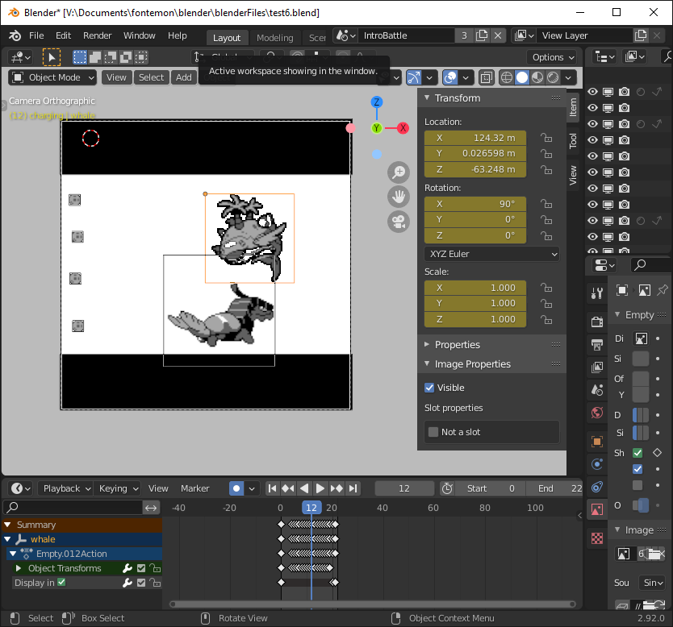

In my attempt to write as little code as possible, I decided to use [blender](https://www.blender.org/) as my game engine. Not to be confused with the blender game engine, which was removed in blender 2.8. I used blender 2.92 (the latest version at the time), then created my own
add-on to do all font-related things.
Overall, it was an okay experience. API Docs were
good (if I had to grade them, B+), and there were enough addons bundled with Blender that I could find a example for almost everything I wanted do.

Other than not wanting to write more code, I chose blender for 2 reasons:

1. Blender's builtin keyframe animation system
   - Making smooth animations was pretty easy in blender. Make a couple of keyframes, edit in graph editor until they looked good, repeat.
2. Blender's customizable node editor

To make development easy, I decided to breakup groups of frames into "Scenes". Each scene corresponds to a [blender scene](https://docs.blender.org/manual/en/latest/scene_layout/scene/introduction.html#introduction), each scene and has its own start/end frame, along with a timeline for easy previewing.

As part of the addon, I created a script that would, every second, poll every object in the scene and adjust its size so that the size matches the exact position of the output, making this a [WYSIWYG](https://en.wikipedia.org/wiki/WYSIWYG) editor.

I laid out all of the game's logic in a custom node editor.

Here is the logic for the whole game:

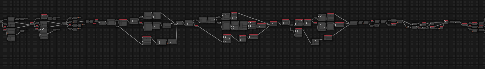
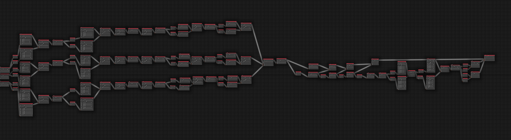

Fontemon has 310 nodes, each scene corresponds to a different blender scene.

Zooming in on the first choice, This is the part of the game where you choose your starting fontemon:


For things that I couldn't (or didn't want to) do in blender, I made some static web page tools:


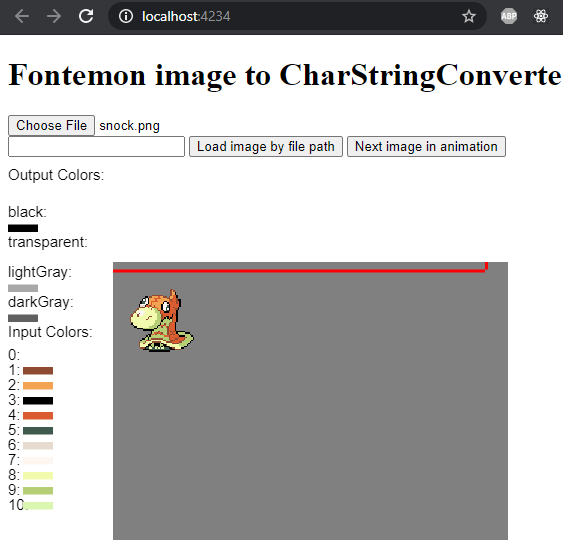


I wrote a full tutorial on how to use the game engine to make your own font games, so I hope you try it out!
(The font game engine is soon to be open source. I just have to clean it up a bit)

## Thanks for reading! [Sponsor me on GitHub to support awesome projects like this!](https://github.com/sponsors/mmulet)
