# Creating your own font games!

Creating your own games is easy and requires no programming know-how!

## Prerequisites

1. Install [blender 2.92](https://www.blender.org/download/releases/2-92/). I cannot guarantee that tools will work with any other version of blender.

2. Download the font-game-engine. [https://github.com/mmulet/font-game-engine/archive/main.zip](https://github.com/mmulet/font-game-engine/archive/main.zip) and unzip.
    
    a. Windows [how to unzip](https://support.microsoft.com/en-us/windows/zip-and-unzip-files-f6dde0a7-0fec-8294-e1d3-703ed85e7ebc)
  
    b. macOS [how to unzip](https://support.apple.com/guide/mac-help/zip-and-unzip-files-and-folders-on-mac-mchlp2528/mac)

# Your first game

The game engine is a Blender add-on, so you have to install blender first, then install the plugin, instructions below:

1. Double click `./blender/blenderFiles/template.blend` to open our template Blender file!
```
--This Directory
 |
 --blender/ <- Open this folder
  | 
  --blenderFiles/ <- Open this folder
    |
    template.blend <- File is here
```

2. Install the fontemon plugin

   a. Open the Preferences Window: Edit > Preferences

   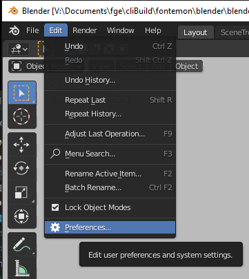

   b. On the left hand side click the Add-ons menu button: Add-ons

   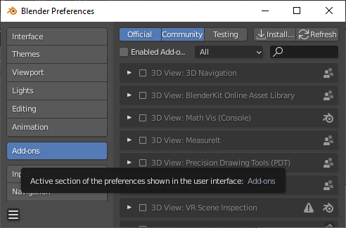

   c. Near the top of the window, click the Install button: Install

   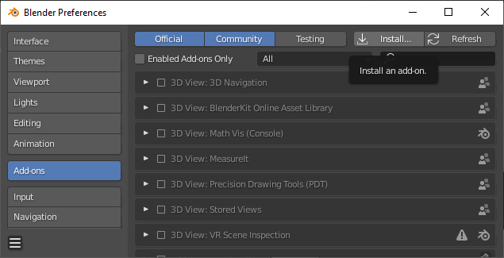

   d. Navigate to the directory you installed, for example our example one is installed in `V:\Documents\fge\cliBuild\fontemon` and click on "fontemon_blender_addon.zip"

   

   e. Near the bottom of the window, click the Install Add-on button
   f. Once the fontemon addon appears, click the empty checkbox on the left hand side. Once you see a check in the checkbox, the add-on is installed and enabled! 
   - Note: if you see a notification pop-up click `allow`. If you don't allow the addon, then some tools (like the image converter, and the font tester, will not work)

   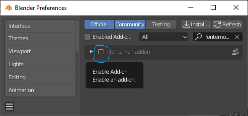


3. You should now be looking at an empty layout

   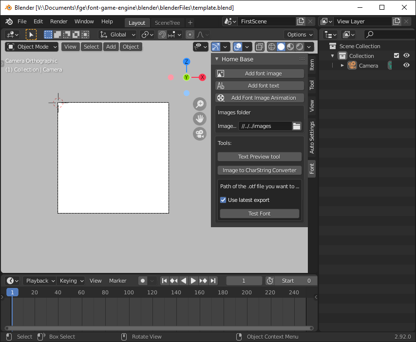

   It's not much to look at now, but soon you will be able to see your game!
   What happens in the layout has a one to one correspondence with with what happens in the
   font. But, first, let's add a sprite!

# Adding a sprite

We are going to add this sprite
 download [here](`./tutorial/sprites/snock.png`)) to our game.
The first thing we are going to do is convert the sprite to a form that a font can handle.
You may have noticed that the sprite is in full color, but the font engine can only display sprites in 4 shades of gray:

- white
- light gray
- dark gray
- black

So we have to use the `Image to CharString Converter` tool.

1. Press the `Image to CharString Converter` button to launch the tool.

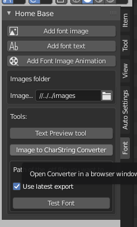

If everything worked, you should see a browser window popup

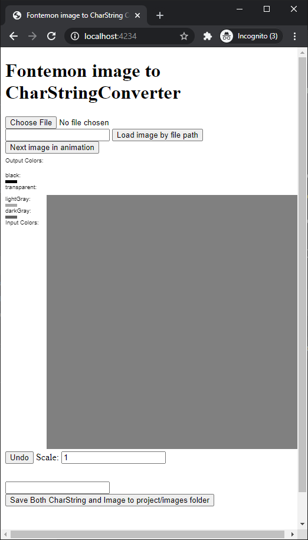

Now you can open our file by either dragging and dropping it on "Choose File" or you
can press the "Choose File" button.

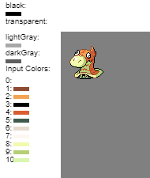

When it works, you will see the image, along with all the colors in the image.

- Your job is to transform the input colors to the output colors:
- Left click on an Input color and you will see a red border around that color. Now,
  click on one of the output colors,
  the input color will disappear and the image will transform all pixels with that input color, to the output color.

Keep going until there are no more input colors left.

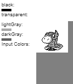

Then, click the "Save Both CharString and Image to project/images" folder button

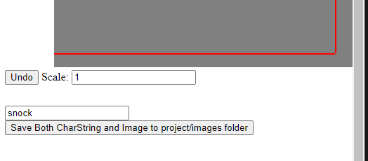

---

## Adding the image to Blender

Now, let's go back Blender:

Let's add an empty image to the scene:

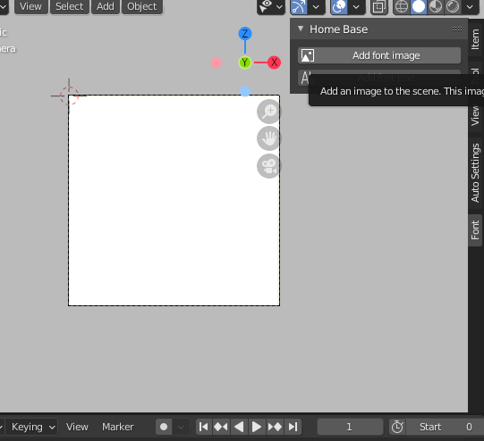

Notice that "Empty" has been added to our Scene Collection!
Click the open button to add our image

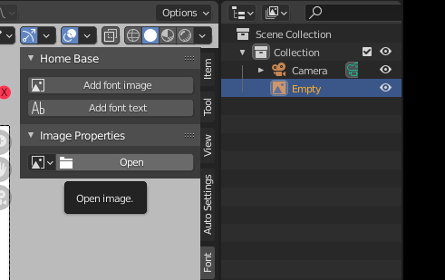

- All image files are saved to ${projectRoot}/images.
- Template.blend is saved to ${projectRoot}/blender/blenderFiles
- So you'll probably have to click the up button, to go up a couple folders
  until you see the images folder. Use the `.png file`, ignore the charStrings folder for now.

Now you should see the sprite!

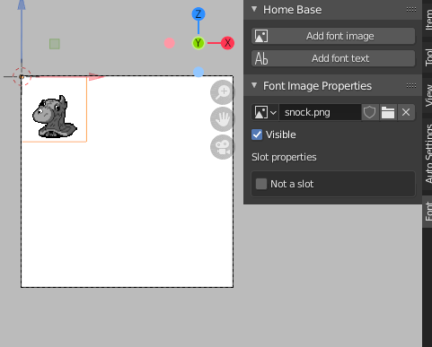

# Moving the sprite!

- Click and drag the Red arrow to move left and right
- Click and drag the Blue arrow to move up and down
- Click and drag the green square to move in any direction

If you don't see the arrows. Click on the image first.

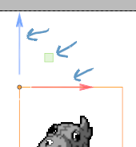

# Making an animation

The font game engines uses Blender's builtin [keyframe animation](https://docs.blender.org/manual/en/latest/animation/keyframes/introduction.html) for animating.
Here's the idea:

1. Turn autokey on. This means that any changes you make to position, will create a "keyframe"

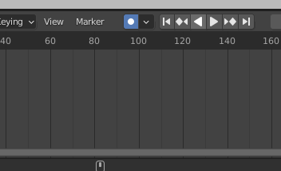

2. Go to your initial position, move the sprite a little. This will create a keyframe at the position you moved it to.
3. Move your current spot in the timeline to when you want to end:
   You can drag the pointer in the timeline

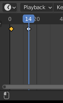

Or you can type it in here:

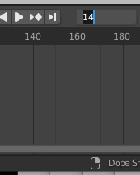

4. Make your changes, like move your guy's position. As you scrub the timeline back and forth you see that he moves back and forth!

   _Remember_ each frame in the timeline is one key the user has to press in the font!

5. _Advanced_ You can change the interpolation between keyframes in any way you like using the [graph editor](https://docs.blender.org/manual/en/latest/editors/graph_editor/introduction.html)
6. Let's set the end frame of our timeline to the end of our animation:

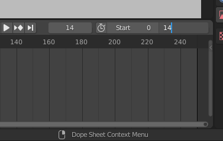

In font engine games, this will _include_ the end frame in our scene, and exclude everything after it.
So, in this example, there are 15 frames in this scene 0,1,2,3,4,5,6,7,8,9,10,11,12,13,14

# Scene Tree #1

We are almost ready to export our first game! Next we have to setup the scene tree.
Up at the top, we are currently in the Layout workspace, click on the SceneTree workspace.

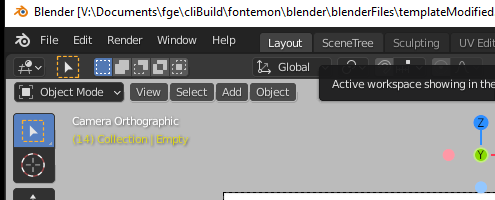

Let's add our first scene node

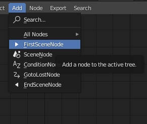

And let's assign our scene named "First Scene" to this node.

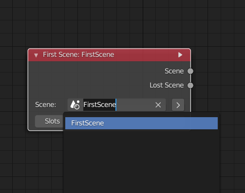

Then, let's add two end scene nodes:

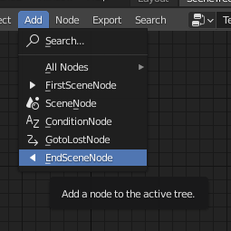

Assign both of those nodes to "First Scene" and let's connect them to the first node we made by dragging the output socket to the input socket.
You should have a tree that looks like this:

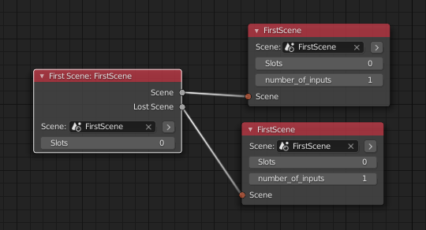


\*Note there are some [Rules to the Scene Tree](#rules-of-the-scene-tree) that you need to remember, but you can read those later.

Now, let's export our game!

1. Press the `Export Scene Tree to Font` button!

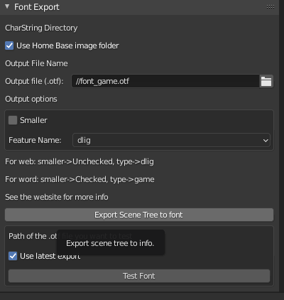

2. Wait for the saved message

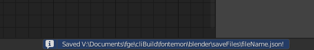

(It goes away pretty quick, so you might miss it)

3. Press the `Test Font` button to open a browser window in which you can test your font.

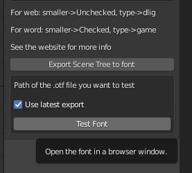


Start typing and you'll see your animation play!


It should play through twice because we connected two nodes, each to the "First scene"!

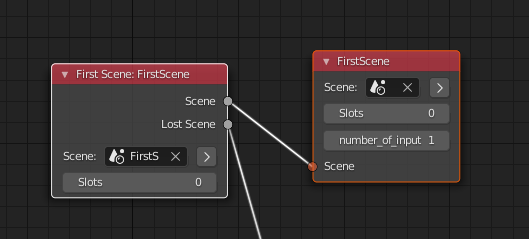

# Creating a second scene

Let's create a second scene, open Blender up again, in the top right corner, click on the the New Scene button (it looks like two pieces of paper on top of each other)

- New Scene -> Full Copy

The easiest thing to do is create a Full copy, this will copy everything from the first scene.

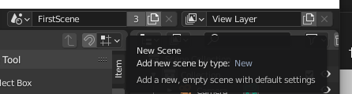 

Then let's rename the scene from "FirstScene.001" to "Second Scene", by double clicking on "FirstScene.001" and typing in our new name.

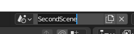

_Note: Right now, our "active scene" is the second scene, you can switch back and forth between scenes at any time by clicking on the button to the left of the scene name. Or by clicking on the jump to scene button on the scene node in the scene tree_

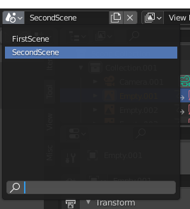
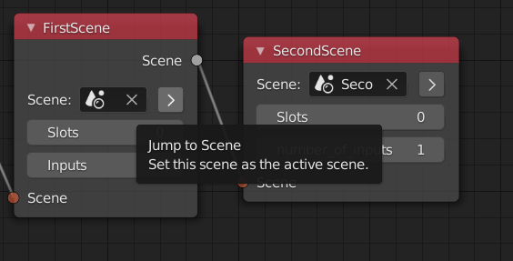

Then we'll switch back to the layout workspace

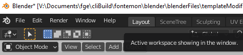

Everything should look just like the FirstScene. But if you look carefully, you'll notice that we are working with duplicates of all the objects. Example: It's now Empty.001 instead of Empty

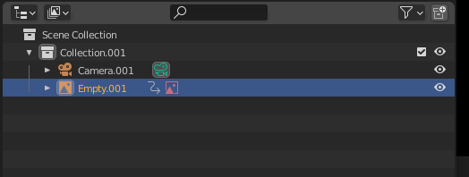

1. Let's copy-paste our empty object, 4 times, so that we have Empty.001 through Empty.005.
2. Now move back to frame 1 or whatever frame you started your animation on. 
3. Move all the object around the screen
4. If you scrub the timeline, it should look like the objects start out scattered and then they merge into
one. Let's consider that a success for now and go back to the SceneTree


On the second node, select the SecondScene from the scene drop down menu

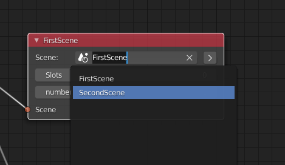

The tree should look like this:

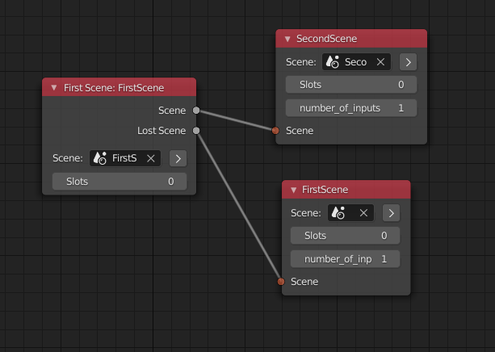

Let's export and preview our new game!
Recall:

1. Press the `Export Scene to Font`
2. Wait for the `Saved` message
3. Press the `Test Font` button (You can skip this step if you still have the window open)

Alright! Now you should see your first scene followed by your second scene.

# Add conditions and make it a game!

So now you can make a scene or two and string them together. But that's not much of a game; there aren't any choices or anything fun. Let's fix that.

Go back to Blender, back to the scene tree. Let's add a condition node

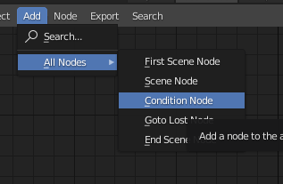

Set up the tree so that it looks like this:

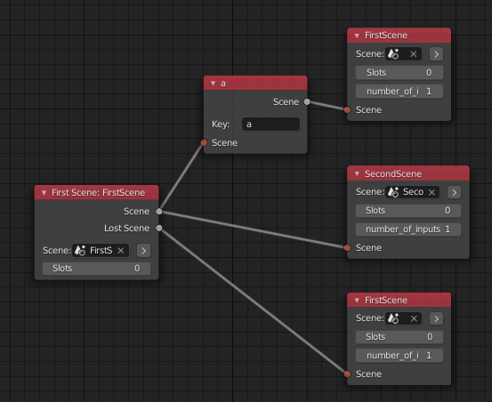

This means that at the end of the first scene, if the player press the "a" (lowercase a, not uppercase A), we will go to the firstScene, otherwise if the player presses any other key we will go to the second scene. Export the scene and try it out!

What happens if no conditions are satisfied, like in this example below?

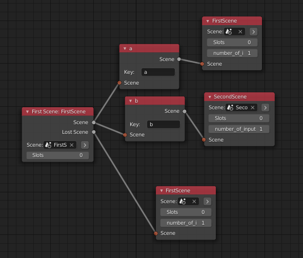

If the player presses:

- a --> go to firstScene
- b --> go to SecondScene
- c or d or anything else? We go to the Lost Scene!

The lost scene is whatever scene we connect to "Lost Scene" socket of the first scne node.
The lost scene is just a convenience for when you make a big game with lots of choices. There is even a goto lost node you can use to jump to the lost scene automatically.

# What about variables or state?

Good question, how do variables or state work? How do you keep track of the user's choices?

Answer: It's all in the nodes.

Look at this example:

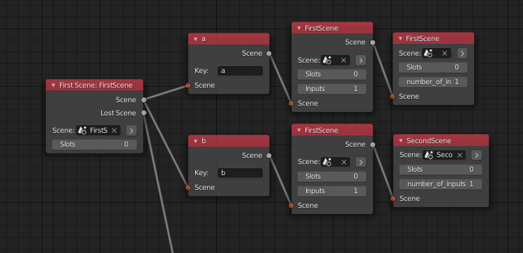

At the end of the first scene if the player presses a, we go to the first scene, if b we also go to the first scene.
It's the scene after the first that we actually use the player's earlier decision! A branching storyline will lead to a branching scene tree. This might seem like more work, but remember, you can use the same scene on multiple nodes. So, you don't have to replicate your animations.

# Visibility

Just because you put a sprite in the scene doesn't mean the game has to draw it all the time! It's a font and if you have
too many sprites it will cause performance issues. Go to the Layout


And select an object, in the Image properties tab you'll see a checkbox for visible:

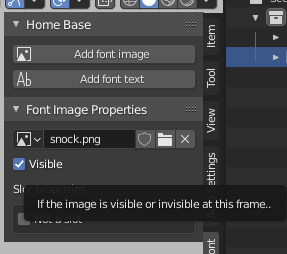

Checking/Unchecking this box, will set the visibility of the sprite and set a keyframe for it!
By creatively turning images off/on we can create the illusion of movement, which brings us to the next topic:

# Animation

We are going to animate some fire! I already converted this fire to charstrings so you don't have to worry about it.
There are 5 images for six frames of the animation:

1. whisp_fire00.png
2. whisp_fire01.png
3. whisp_fire02.png
4. whisp_fire03.png
5. whisp_fire04.png

Let's start with fresh `Full copy` of 'FirstScene' and let's rename it "Fire scene".

Click the `Add font Image Animation` button

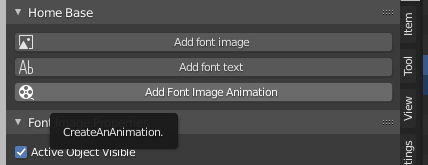

Notice that two new properties appeared in the Image properties panel:

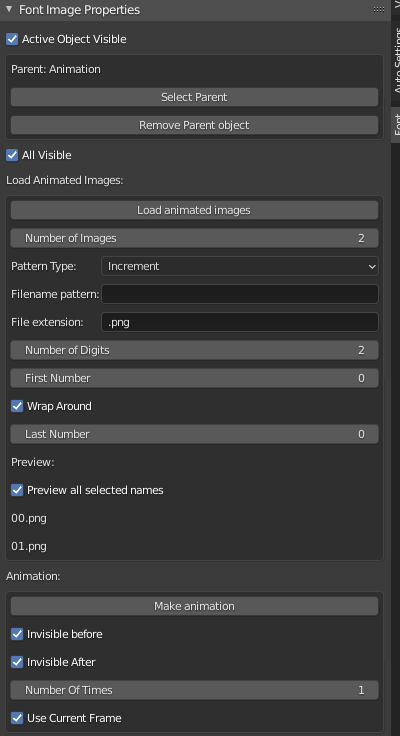

1. Load animated Images
2. Animation

We're going to talk about `Load Animated images` first

## Load Animated Images

Load animated images let's you load a lot of images quickly, using `patterns`

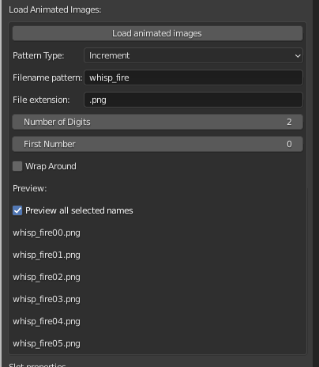

Let me explain what each of these fields mean.

1. `Number Of Images`. Our animation has 5 images, so we'll type in `5`
1. `Pattern Type`. We have it to `Increment` we means will load images in ascending sequence, 1,2,3,4,5 etc. The other modes are for more advanced users.
1. `Filename`. In this field we need to put before the number. Our file names are `whisp_fire00.png`, `whisp_fire01.png` etc. So let's type in `whisp_fire`
1. `File extension` Everything after the numbers goes here, so it's .png in our case.
1. `Number of Digits` We have two digits so, let's type in 2
1. `First Number` In this field we need the first number, we start at `00` so let's type in `0`
1. `Wrap Around` This is for advanced users, uncheck it in our case.

Then you can see in the preview that we have generated all the file names we want.

Press the `Load Animated Images` button to load all the images onto the objects you selected.

- Note: They are assigned to your objects in alphabetical order. So, Animation.001 -> whisp_fire00.png, Animation.002 -> whisp_fire01.png and so on.

There are a lot of options for loading animated images, so once you get the hang of it, you can try some of the more advanced settings.

## Animation

The animation button is simple enough, press it and it will adjust the visibility of each image so that only one image is visible at a time!

Try it out, add the scene to your scene tree, export it and see your fire dance!

### Parenting

When making an animation, you might want to move all of the frames of the animation at once. To do this, you need to move the parent object. Click, the select Parent button (or create parent button)

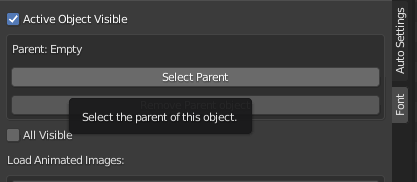

Now you can move the parent object around and it will move all the child objects at once!

# Text

To create text, the first thing you'll need is a font! A font for your font! Luckily for you, this game engine has one
font built-in, `gohufont`. There is nothing special about the font images, they are just images and charstings in the ./images directory like everything else.
Let's add some text to our game by pressing the `Add Font Text Button`

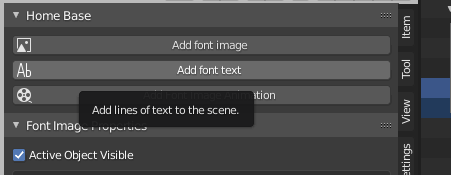

This will create text properties that you can edit!

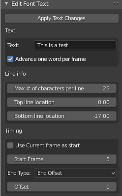

- Type your text in the text box (but there is a better way, keep reading to learn more about it)
- Choose whether you want to advance one word or one character per frame
- Use the Timing info to decide when the text will appear/disappear.
  - The first part of timing info is the start frame, when the text will appear. When the Current frame as start checkbox is clicked, it will appear on the the frame you are currently on. When it is off, you can type the frame in the box.
  - Next we have the end type. This determines when the text will disappear
    There are four types
  1.  End Frame. The text will disappear on this frame
  2.  Length. The text will disappear after this many frames after the start of the text
  3.  End Offset. The text will disappear after this many frames after the _end_ of the text
  4.  Infinite. The text will never disappear.

When you are done making your changes, click the `Apply Text Changes` button

# Previewing Text

When composing text of more than a few lines, using the Blender interface is kind of a pain. Use the textPreviewTool to
fix this!
1. Press the `Text Preview tool` button

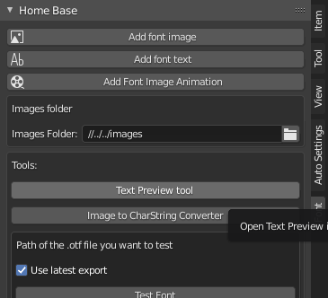

You should see a browser window popup with your text preview tool!

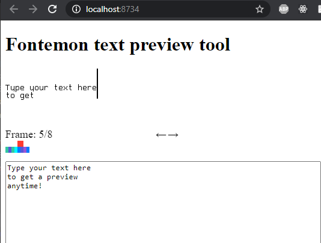

Type your text in the textbox, then use the frame slider to preview it
at different times. When you are done, press the `Transform output` button

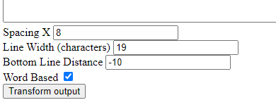

_Note_ Want two-word phrase to appear on the same frame? Use \ instead of space!
Example: `we are not tomatoes` vs `we are not\ tomatoes`.

Example `we are not tomatoes` is 4 frames long

1. we
2. we are
3. we are not
4. we are not tomatoes

Example `we are not\ tomatoes` is 3 frames long

1. we
2. we are
3. we are not tomatoes

This will copy your text to your clipboard, then just paste it in the proper place in Blender

# Slots

You've already learned the basics and can now probably create your own game! But, there is one more _advanced_ feature
that may really come in handy. Slots.
Let's say you have a branching story and you want to reuse one long scene in two different branches, but the scene has some minor changes in each branch so you can't. With slots you can! Slots let you replace certain images in a scene with other images that you define on the node.

On an object's image Properties, check the "Slot" checkbox

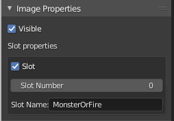

This brings up two new properties

1. Slot number - All images that share a slot number will be replaced by the same image
2. Slot name - Just for you to keep track of what you assigned to each slot number.

Now, go back to the scene tree


On the node where you want to include the slot, click on the right arrow to increase the number of slots by 1.
You should see the name of the slot that you wrote next to a blank image selector.

_Note_ If the number of slots in a scene don't match up to the number of slots on a node, the add-on will tell
you when you export.

Click on the selector to select an image to use with this slot.

# Slot Node Tree

Let's say you have a lot of slots in your scene and you want to delete one, but it's slot number 8 and you have 15 slots. So now it's a huge pain. Use the slots node tree!

The slots node tree is a tree representation of all the slots in your scene.


The root of the tree, is a node representing your scene. That node connects to nodes representing sprites,
which in turn connect to nodes representing slots.
You can:

1. Add slots in between slots, shifting all slot numbers up as necessary
2. Remove slots, shifting all slot numbers down as necessary
3. And more.

When you are finished making your changes, press the `Fix slots` button at the root of the tree. Then , you can delete the slot node tree if you wish.

# Rules of the Scene Tree

1. No loops. A node cannot connect to itself in any way.


2. Lost Scene conditions must always have a default condition! Otherwise, there is an implied goto lost scene which is a loop which violates rule #1. Likewise, the lost scene cannot contain any goto lost scene nodes.


# This is the End of the Tutorial

Let me know if you have any questions, also let me see all the games you create!
